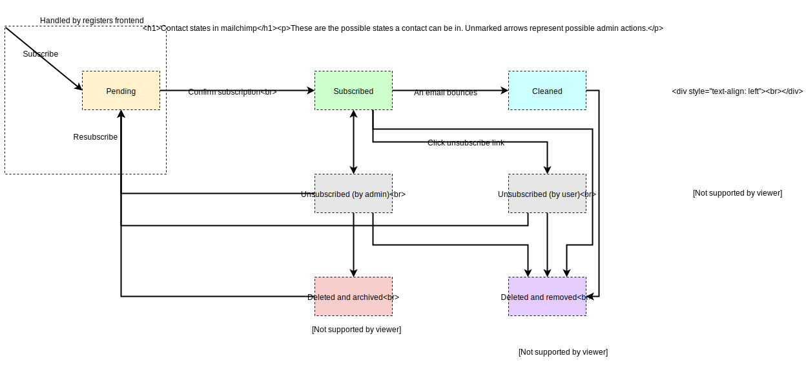
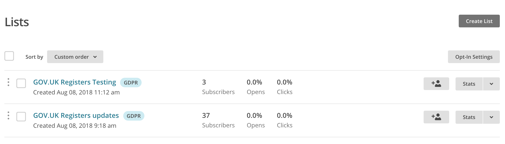
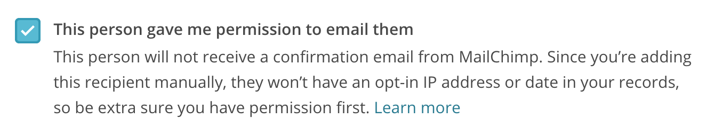

# Troubleshoot email subscriptions

## Who can receive email
A mailchimp contact must have a state of "subscribed" to receive email.

Subscribing normally involves filling out the form in registers frontend, and then following the link in a confirmation email.

## How to view the contact state in Mailchimp

The "lists" section in mailchimp can show you whether mailchimp knows about an email address.

- `GOV.UK Registers` updates is the one we use in production.
- `GOV.UK Registers testing` is the one registers frontend uses in development mode

The default view doesn't show users who are in a "pending" state, but you can use the search function to check if there is any record of an email address, regardless of state.

If you get no results, that means the signup process didn't work, or the user enterred their email incorrectly.

Otherwise, click view profile to see the contact state.

## When a user hasn't received the confirmation email
If the user hasn't received the confirmation email, search for the account (see above) to see whether they were added to mailchimp.

If not, check the logs for registers frontend in Kibana. If the API call to mailchimp failed, it should log an error.

If the contact is pending, then everything is ok from our end. [There are some troubleshooting tips the user can try](https://mailchimp.com/help/troubleshoot-the-opt-in-confirmation-email/), such as checking their spam folder for the confirmation email. Also, if the user tries the signup form again, mailchimp should send the confirmation email again.

Failing that, you can manually add the user by clicking "add contacts" from the list page. Note that this won't send a confirmation email, so it should only be done with the user's permission.

## More info
- [Email reference](/manual/email.html)